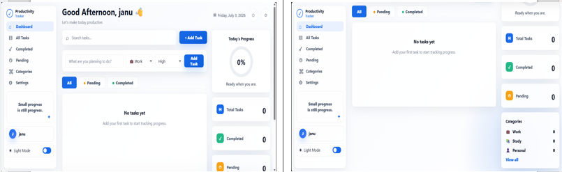
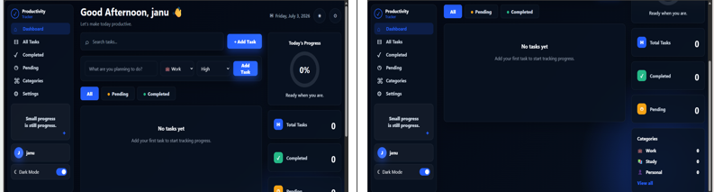
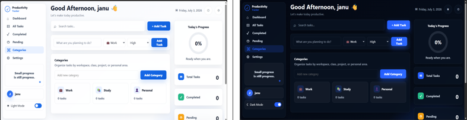
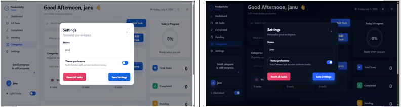

# 📋 Productivity Dashboard

A modern and responsive productivity dashboard built using **HTML, CSS, and JavaScript**. The application helps users manage daily tasks efficiently with categories, priority levels, progress tracking, search functionality, dark mode, and local storage support.

---

# ✨ Features

## ✅ Task Management

- Add new tasks
- Edit existing tasks
- Delete tasks
- Mark tasks as completed
- View pending tasks
- View completed tasks

## 📂 Categories

- Built-in categories
  - 💼 Work
  - 📚 Study
  - 👤 Personal
- Create custom categories
- Category-wise task organization

## 🚩 Priority Levels

Assign priority for every task:

- 🔴 High
- 🟡 Medium
- 🟢 Low

## 📊 Dashboard Analytics

Displays:

- Total Tasks
- Completed Tasks
- Pending Tasks
- Circular Progress Indicator
- Completion Percentage

## 🔍 Search & Filters

- Search tasks instantly
- Filter:
  - All Tasks
  - Pending
  - Completed

## 🌙 Theme Support

- Light Mode
- Dark Mode
- Quick Theme Toggle

## ⚙️ User Settings

- Change username
- Personalized greeting
- Reset all tasks

## 💾 Local Storage

Automatically saves:

- Tasks
- Categories
- Theme
- Username

Data remains available even after refreshing the browser.

## 📱 Responsive Design

Optimized for:

- Mobile
- Tablet
- Laptop
- Desktop

---

# 🛠️ Technologies Used

- HTML5
- CSS3
- JavaScript (ES6)
- Local Storage API

---

# 📂 Project Structure

```text
├── assets/
│   └── screenshots/
├── index.html
├── style.css
├── script.js
└── README.md
```

---

# 🚀 How to Run

1. Clone or download this repository.
2. Open `index.html` in your browser.
3. Start adding and managing your daily tasks.

No installation or external dependencies are required.

---

# 📸 Screenshots

### 🏠 Dashboard



### 🌙 Dark Mode



### 📂 Categories



### ⚙️ Settings



---

# 🔮 Future Enhancements

- Due Dates
- Task Reminders
- Calendar Integration
- Drag & Drop Tasks
- Cloud Sync
- Export Tasks
- Recurring Tasks
- Notifications

---

# 👩‍💻 Author

**Janaki D**

